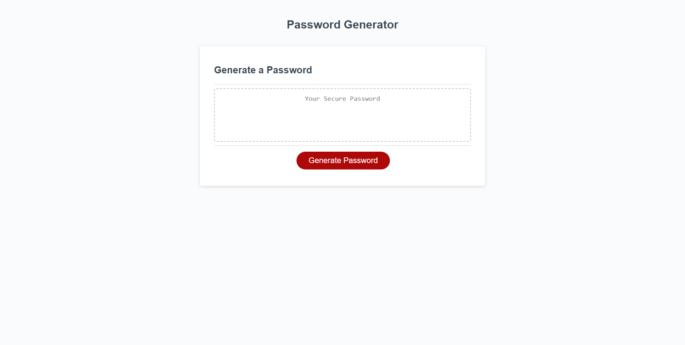

# Password Generator

## Description
A webpage designed to accept user input and create a secure password. User can select password length of 1-128 characters and whether to include uppercase, lowercase, symbols, and numbers. Using these criteria, a random password will be created.

## Application Screenshot

## Application link
https://brennaveir.github.io/password-generator/